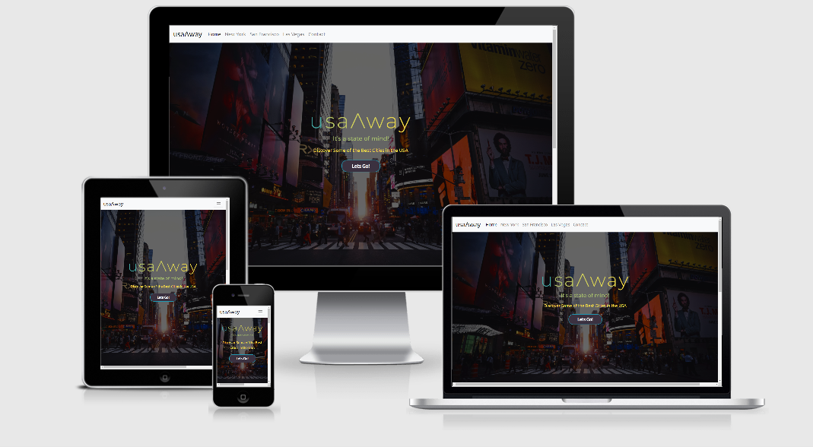
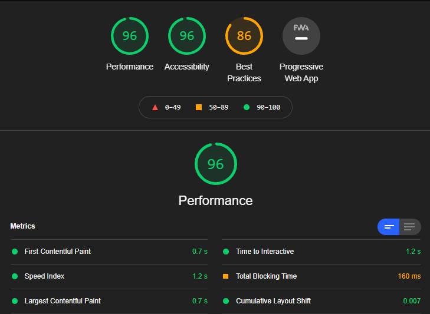
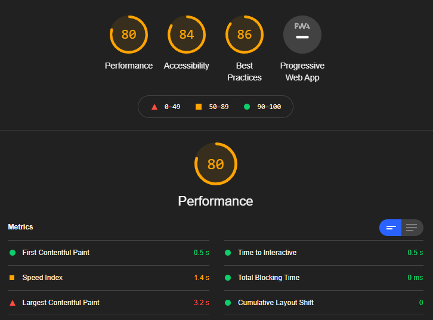
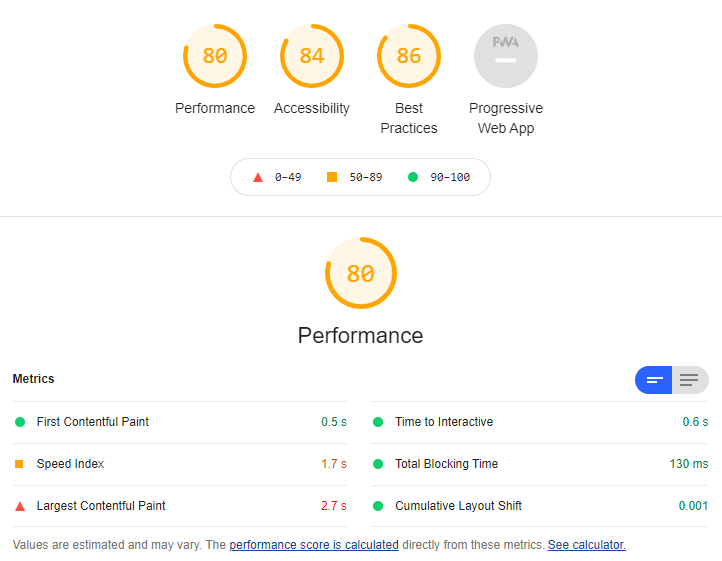
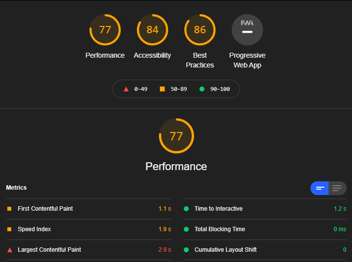

This is a screenshot from [Am I Responsive](http://ami.responsivedesign.is/)
# usaΛway

This website is for people to learn about and explore some great American cities.

## Table of Contents
1. [User Experience](#User-Experience-UX)
2. [Design](#Design)
    - [Wireframes](#wireframes)
	- [Fonts](#Fonts)
	- [Colour Scheme](#Colour-Scheme)

3. [Features](#Features)
    - [Features Currently Implemented](#Features-Currently-Implemented)
	- [Features Left to Implement](#Features-Left-to-Implement)
	
4. [Technologies Used](#Technologies-Used)
    - [Languages](#Languages)
	- [Frameworks, Libraries and Programs](#Frameworks-Libraries-and-Programs)
	
5. [Testing](#Testing)
    - [Testing User Stories](#Testing-User-Stories)
	- [Further Testing](#Further-Testing)
	
6. [Deployment](#Deployment)
    - [GitHub Pages](#GitHub-Pages)
	- [Making a Local Clone](#Making-a-Local-Clone)
	
7. [Credits](#Credits)
8. [Media](#Media)
9. [Acknowledgements](#Acknowledgements)

---
 
## User Experience UX

### User Requirements

- As a **User** I want to be able to easily understand what the website is for.
- As a **User** I want to be able to easily navigate the website.
- As a **User** I want to easily find attractions, bars, restaurants and hotels.
- As a **User** i want to be able to find contact details.
- As a **User** i want to see to be able to see locations on an interactive map.

### Owners Requirements

- As an **Owner** I want the home page to immediately tell the User what the site is for.
- As an **Owner** I want the User to be able to easily navigate the site via navigation links.
- As an **Owner** I want to be able to advertise cities and be able to provide information about them.
- As an **Owner** I want potential clients to be able to easily contact me.

[Contents](#Table-of-Contents)

---

## Design

I did the design for this website using Balsamiq to create the wireframes. I have created wireframes for desktop, tablet and mobile

### Wireframes

|                                                      usaAway                                            	|
|:--------------------------------------------------------------------------------------------------------------:
| [Desktop](https://github.com/horizons83/Milestone2-usaAway/blob/master/assets/wireframes/Desktop.pdf) 	|  
|  [Tablet](https://github.com/horizons83/Milestone2-usaAway/blob/master/assets/wireframes/Tablet.pdf)  	|  
|  [Mobile](https://github.com/horizons83/Milestone2-usaAway/blob/master/assets/wireframes/Mobile.pdf)  	|  
 

I wanted to keep the design simple and easy to navigate so potential clients can find the information they want easily.
I wanted to use google API to be able to give users valid information 
I wanted a contact modal available on every page so users could send me a message.

### Fonts

I have used fonts from [google fonts](https://fonts.google.com/) I selected Ubuntu and Roboto as they were a suggested pair and so
complement each other. I have used "Ubuntu" for the menu and main headings then "Roboto" for paragraphs making it easier on the eye
to read text sections.

### Colour Scheme
I wanted to use plain colours like whites for backgrounds where no images were present so that the users were not destracted from information.

[Contents](#Table-of-Contents)

---

## Features

### Features Currently Implemented

- The website is responsive.
- Design is and easy on the eye.
- The Contact modal is accessiblefrom all pages.
- Easy to follow navbar.
- Gallery of city images on each city page.
- Social links are included on every page.

### Features Left to Implement
- Abilty to sell and book city breaks through site.
- Ability to create custom roads trips around the USA using google maps to plan route.

[Contents](#Table-of-Contents)

---

## Technologies Used

### Languages

- [HTML5](https://developer.mozilla.org/en-US/docs/Web/Guide/HTML/HTML5)
- [CSS3](https://developer.mozilla.org/en-US/docs/Web/CSS)
- [Javascript](https://www.javascript.com/)

### Frameworks Libraries and Programs

* [Balsamiq](https://balsamiq.com/)
   * Balsamiq was used to create the wireframes for the project during the design stage.
 
* [Bootstrap V4.5](https://getbootstrap.com/)
   * I used bootstrap to give the site a responsive layout and the ability to add a Nav and a Modal to the about and gallery pages.

* [Fontawsome V5](https://fontawesome.com/)
   * I used fontawsome to provide icons for Nav logo, Modal buttons and social media icons.

* [Google Fonts](https://fonts.google.com/)
   * Google fonts was used to provide Lobster and Roboto fonts for the site.
 
* [GitPod](https://www.gitpod.io/)
   * GitPod is the online IDE used to code the project.
 
* [Git](https://git-scm.com/)
   * Git was used for version control to commit and push from GitPod to GitHub.
 
* [GitHub](https://github.com/)
   * GitHub is the repository used to store the project.

[Contents](#Table-of-Contents) 

---

## Testing

I used the WC3 HTML validator and the WC3 CSS validator to test every page of the website to check that there were no errors present.
below are the results of the checks.

* [WC3 HTML Validator](https://validator.w3.org/)
   * [index.html](https://validator.w3.org/nu/?doc=https%3A%2F%2Fhorizons83.github.io%2FMilestone2-usaAway%2F) No errors and 2 warnings to show for no heading in section and also use of Type in javascript script.
   * [newyork.html](https://validator.w3.org/nu/?doc=https%3A%2F%2Fhorizons83.github.io%2FMilestone2-usaAway%2Fnewyork.html) No errors but does show warning for no heading in section.
   * [sanfran.html](https://validator.w3.org/nu/?doc=https%3A%2F%2Fhorizons83.github.io%2FMilestone2-usaAway%2Fsanfran.html) No errors but does show warning for no heading in section.
   * [lasvegas.html](https://validator.w3.org/nu/?doc=https%3A%2F%2Fhorizons83.github.io%2FMilestone2-usaAway%2Flasvegas.html) No errors but does show warning for no heading in section.
   
* [WC3 CSS Validator](https://jigsaw.w3.org/css-validator/)
   * Shows no errors found but does show warnings for -
       * -webkit-box-orient
	   * -webkit-box-direction
	   * -ms-flex-direction
	   * ::-webkit-scrollbar
	   * -webkit-background-size
	   * -moz-background-size
	   * -o-background-size
	   * -o-object-fit
	   * -webkit-transition

### Testing User Stories

As a **user** I want to be able to easily understand what the website is for:
- I have added a full size background image with a title and slogan ( usaΛway "Its a state of mind" ) center page which is large and easy to read.

As a **user** I want to be able to easily navigate the website: 
- I have placed a Navbar at the top of every page with links to all pages. The Navbar is fixed and therefore always available at the top of the page even when scrolling. I have also included usaΛway brand on the Navbar which if clicked takes you back to the landing page.
	   
As a **user** I want to be able to easily find attractions, bars, restaurants and hotels:
- I have created a map section on each city page which uses the Google Maps API to retreave required data.
	 	 
As a **user**  I want to be able to contact owner:
- I have included a contact modal with email address and also a contact form that can be filled out.
	 
As a **user** i want to see location details and reviews of attractions, bars, : 
- On the Contact page I have included a location, postcodes covered and also map highlighting the areas covered.

### Further Testing

as well as validating the code I have also tested the responsivness across different browsers and devices. I also used devtools to test the responsiveness during development
to ensure the design would react correctly.

I have also used Lighthouse within the devtools to check the performance of the website and have included screenshots.

- index.html

- newyork.html

- sanfran.html

- lasvegas.html

Further testing for this site can also be found here [Manual Testing]()

[Contents](#Table-of-Contents)

---

## Deployment

### GitHub Pages

The project was deployed to GitHub Pages using the following steps:
   
   1. After pushing the project to GitHub from GitPod I logged into the GitHub site.
   2. I then located the [repository](https://github.com/horizons83/Milestone2-usaAway) for the project.
   3. I then clicked the settings cog located at the top of the repository.
   4. On the settings page I scrolled down to the GitHub Pages section.
   5. Under "Source" I selected "master branch" from the menu.
   6. After a few minutes I received the message " Your site is published at https://horizons83.github.io/Milestone2-usaAway/ "
   
The website can be viewed here: https://horizons83.github.io/Milestone2-usaAway/
   
### Making a Local Clone

To make a local clone of the repository on your computer:
   
   1. Open GitHub and locate the repository https://github.com/horizons83/Milestone2-usaAway
   2. Above the file list click "Code" and copy the link using HTTPS.
   3. After copying the link open Terminal on your computer or using Terminal on an IDE.
   4. Change the current working directory to the location where you want the clone to be saved.
   5. Type git clone, then paste the URL: https://github.com/horizons83/Milestone2-usaAway.git
      
      `git clone https://github.com/horizons83/Milestone2-usaAway.git`
   
   6. Press Enter to create the local clone.	  

[Contents](#Table-of-Contents)

---

## Credits

- Contact Modal was taken from Bootstrap documentation for [Bootstrap 4](https://getbootstrap.com/docs/4.5/components/modal/)
- The pricing cards on the Services page were taken from [bbbootstrap](https://bbbootstrap.com/snippets/responsive-pricing-table-79450012) and adapted to suit.
- The code for the gallery was taken from [Fullyworld_web_tutorials](https://codepen.io/Fullyworld_Web_Tutorials/pen/KKdppEZ)
- Maps and Markers are delivered by [Google API](https://cloud.google.com/maps-platform) from Google.

### Media
- The photos used in this site were obtained from [Unsplash](https://unsplash.com/)
- Photos were resized using [PicResize](https://picresize.com/)
- All photos were compressed using [Tinyjpg](https://tinyjpg.com/) to help site loading times.
- Gallery imaghes were taken from [Pexels](https://www.pexels.com/)

### Acknowledgements

- I received inspiration for this project from my love of visiting the USA.
- I'd like to say a big thank you to my mentor Gerry Mcbride for his advice.
